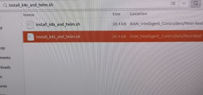
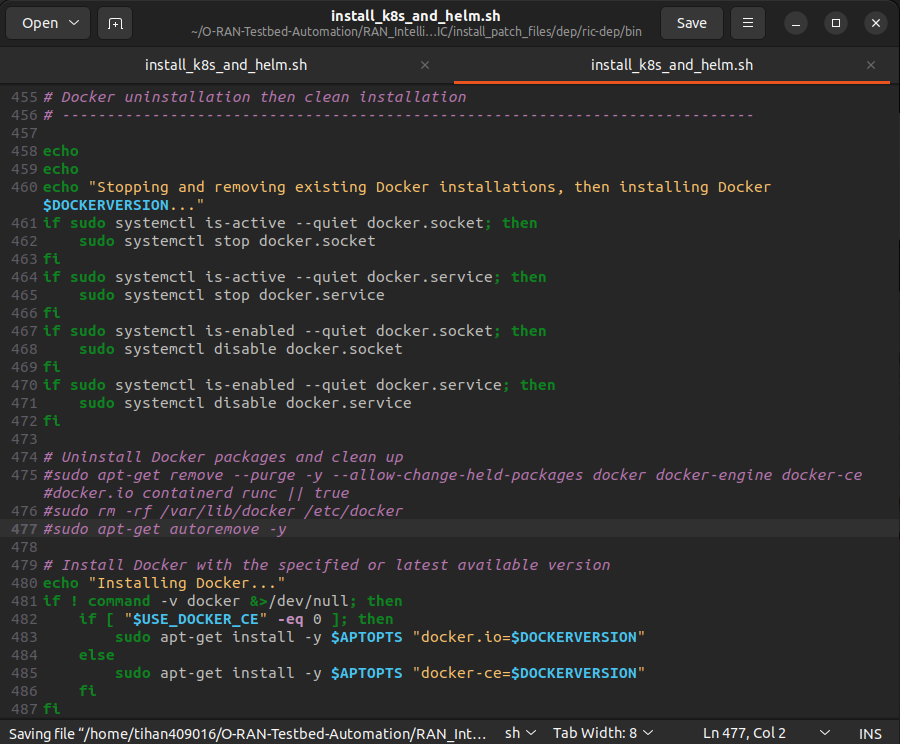
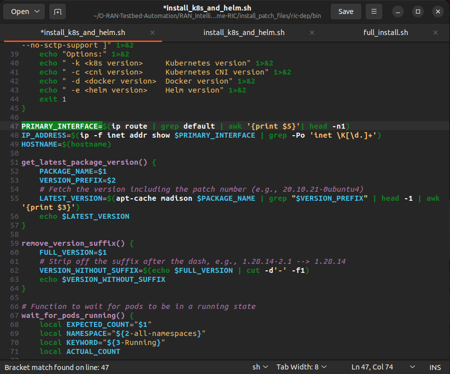
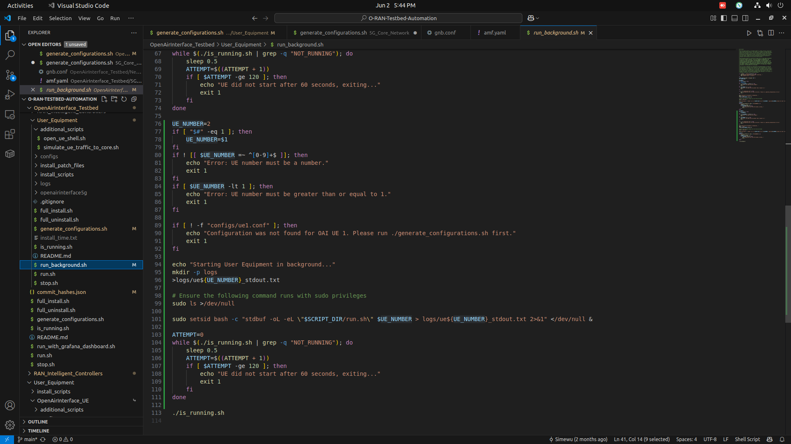
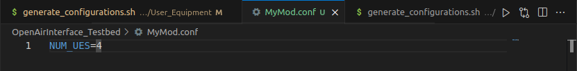
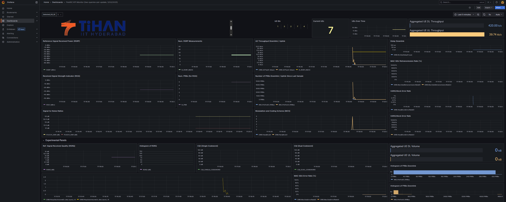

# O-RAN-Testbed-Automation
## O-RAN-Testbed-Automation (PT1: O-RAN SC Near-RT RIC and srsRAN)
### Implementation: https://github.com/usnistgov/O-RAN-Testbed-Automation

### RUN:

```bash
./run.sh
```

```bash
./stop.sh
```

```bash
./is_running.sh
```

### To Visualize:

```bash
cd ~/O-RAN-Testbed-Automation/RAN_Intelligent_Controllers/Near-Real-Time-RIC
./additional_scripts/hubble_visualize.sh
```

**(It will take time to run even though it shows errors)**

## INSTALL:
**Install in Home Directory:**

```bash
sudo apt-get update && sudo apt-get upgrade -y
sudo apt-get install -y git
git clone https://github.com/USNISTGOV/O-RAN-Testbed-Automation.git
cd O-RAN-Testbed-Automation
./full_install.sh
```

## DOCKER ERROR:
**Install Docker-Ce**

```bash
sudo apt install docker-ce
```

Search for the file names :  `install_k8s_and_helm.sh`



And change the Two Files.

**If more than 2 files are seen then _Re-download_.**

**Change Files:**

`Near-Real-Time-RIC`

`Non-Real-Time-RIC`

Comment the Docker Clean Up Part in (Line 474)

```bash
# Uninstall Docker packages and clean up
#sudo apt-get remove --purge -y --allow-change-held-packages docker docker-engine docker-ce #docker.io containerd runc || true
#sudo rm -rf /var/lib/docker /etc/docker
#sudo apt-get autoremove -y
```



**If it doesn't work then Comment the entire Docker Part upto Installing (Excluding Installing)**

## MULTIPLE INTERFACE ERROR:
**CHANGE:**

```bash
PRIMARY_INTERFACE=$(ip route | grep default | awk '{print $5}')
```

**TO:**

```bash
PRIMARY_INTERFACE=$(ip route | grep default | awk '{print $5}'| head -n1)
```


## INSTALL CILIUM: (Visual Viewer)

```bash
cd ~/O-RAN-Testbed-Automation/RAN_Intelligent_Controllers/Near-Real-Time-RIC
./additional_scripts/install_cilium_and_migrate_nodes.sh
```

## KUBERNETES ERROR:

**Turn OFF swap for Kubernetes to work.**

```bash
sudo swapoff -a
sudo kubeadm reset -f 
sudo systemctl restart kubelet
sudo kubeadm init
```

**View List of Kubernetes pods running**

```bash
kubectl get pods -A
```

## O-RAN-Testbed-Automation (PT2: OpenAirInterface and FlexRIC)
### Implementation: https://github.com/usnistgov/O-RAN-Testbed-Automation

## RUN:
```bash
./run.sh 
./run_with_grafana_dashboard.sh #Run with Grafana # Ctrl+Z to Stop
./stop.sh   #To stop the running ALWAYS RUN THIS FOR STOPPING 
./is_running.sh
```
## To Visualize:
```bash
./run_with_grafana_dashboard.sh
```

**IMPORTANT :** *Select Time to ‘some value’ on the top right side of the Dashboard*

## UE ERROR:
While Running `./run_with_grafana_dashboard.sh` if you get a UE error. Wait for a few seconds and re-run.

## AMF ERROR:
While Running `./run_with_grafana_dashboard.sh` if you get an AMF error. 

Manually run

`./run.sh` in **5G_Core_Network** First, then **Next_Generation_Node_B** then **User_Equipment**. 

Finally, run `./run.sh` in the root folder.

## SIMULATION TRAFFIC ERROR:
Use only One Network interface (Wifi only) **[Disconnect LAN]**. 

Then Re-Run `./run_with_grafana_dashboard.sh.` and `./simulate_ue_traffic_to_core.sh`


## SETTING UP:
```bash
./run_with_grafana_dashboard.sh
```

**yesoreyeram-infinity-datasource:**

Select the **Infinity Data Source** in Add new Data source.

`Connections → Data sources → Add data source → Infinity`

**Configure the Infinity Data source:**

Go to `URL, Headers & Params → Base URL → Type "http://localhost:3030/KPI_Metrics.csv" → Save & test.`

Stop and restart `./run_with_grafana_dashboard.sh`

**Grafana dashboard:**

Use the JSON from `additional_scripts/grafana_xapp_dashboard.json`

## RE-INSTALLING:

**Uninstall:**

First, run `./full_uninstall.sh` run in **~/O-RAN-Testbed-Automation** NOT IN OpenAirInterface_Testbed.
Then, run `./full_uninstall.sh` in **~/O-RAN-Testbed-Automation/OpenAirInterface_Testbed**

**Install:**

Run 
```bash
sudo apt install docker-ce
```
Run 
```bash
./full_install.sh in ~/O-RAN-Testbed-Automation/OpenAirInterface_Testbed
```

## ADDING UEs: (OPTIONAL)
**See `Modifications` Section for Direct Implementation.**

### Step 1:

In the File : `~/O-RAN-Testbed-Automation/OpenAirInterface_Testbed/User_Equipment/run_background.sh`

Add this with New UE Number to add another UE : (Add before `./is_running.sh`):

```bash
UE_NUMBER=1
if [ "$#" -eq 1 ]; then
    UE_NUMBER=$1
fi
if ! [[ $UE_NUMBER =~ ^[0-9]+$ ]]; then
    echo "Error: UE number must be a number."
    exit 1
fi
if [ $UE_NUMBER -lt 1 ]; then
    echo "Error: UE number must be greater than or equal to 1."
    exit 1
fi

if [ ! -f "configs/ue1.conf" ]; then
    echo "Configuration was not found for OAI UE 1. Please run ./generate_configurations.sh first."
    exit 1
fi

echo "Starting User Equipment in background..."
mkdir -p logs
>logs/ue${UE_NUMBER}_stdout.txt

# Ensure the following command runs with sudo privileges
sudo ls >/dev/null

sudo setsid bash -c "stdbuf -oL -eL \"$SCRIPT_DIR/run.sh\" $UE_NUMBER > logs/ue${UE_NUMBER}_stdout.txt 2>&1" </dev/null &

ATTEMPT=0
while $(./is_running.sh | grep -q "NOT_RUNNING"); do
    sleep 0.5
    ATTEMPT=$((ATTEMPT + 1))
    if [ $ATTEMPT -ge 120 ]; then
        echo "UE did not start after 60 seconds, exiting..."
        exit 1
    fi
done
```



**Then Run :**
```bash
./generate_configurations.sh
```
### Step 2:
In the File : `~/O-RAN-Testbed-Automation/OpenAirInterface_Testbed/User_Equipment/generate_configurations.sh`

**Change line 116:**
```bash
for UE_NUMBER in {1..5}; do
```

Enter the Number of UE’s in the For Loop

**Then Run :**
```bash
./generate_configurations.sh
```

## UE TRAFFIC SIMULATION

**Terminal 1:** 

Run:
```bash
./run_with_grafana_dashboard.sh.
``` 
**Terminal 2:**

Open the folder 

```bash
cd ~/O-RAN-Testbed-Automation/OpenAirInterface_Testbed/User_Equipment/additional_scripts
```

Run:
```bash
./simulate_ue_traffic_to_core.sh
```

# Modifications
## Multiple UEs:

Use the files in the Github Repo to the following folders as shown below.

**Root Folder :** `~/O-RAN-Testbed-Automation/OpenAirInterface_Testbed/`

```bash
Root Folder (OpenAirInterface_Testbed)
├──	MyCheck.sh
└──	MyMod.conf

User_Equipment
├── generate_configurations.sh
└── run_background.sh

5G_Core_Network
└── generate_configurations.sh
```

**NOTE:** The *User_Equipment* and *5G_Core_Network* of the *OpenAirInterface_Testbed* **NOT** *O-RAN-Testbed-Automation*.

## Usage:

Just modify the Number of UEs in `MyMod.conf`



and then Run 
```bash
./run_with_grafana_dashboard.sh
```

## Dashboard Modification:

Import the file `TiHAN-1749018629332.json` in Grafana Dashboard


